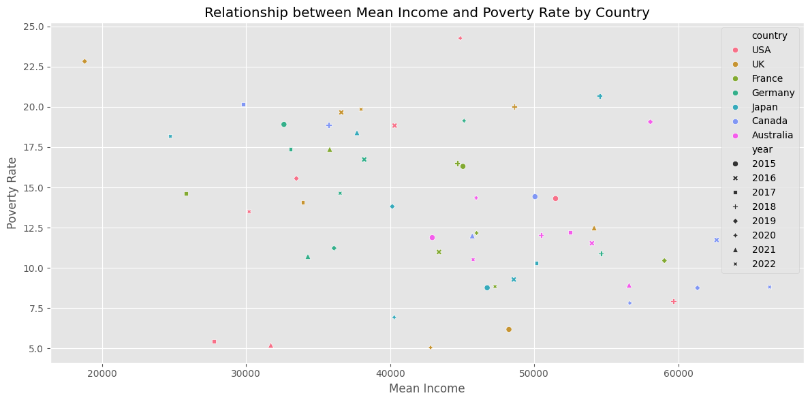
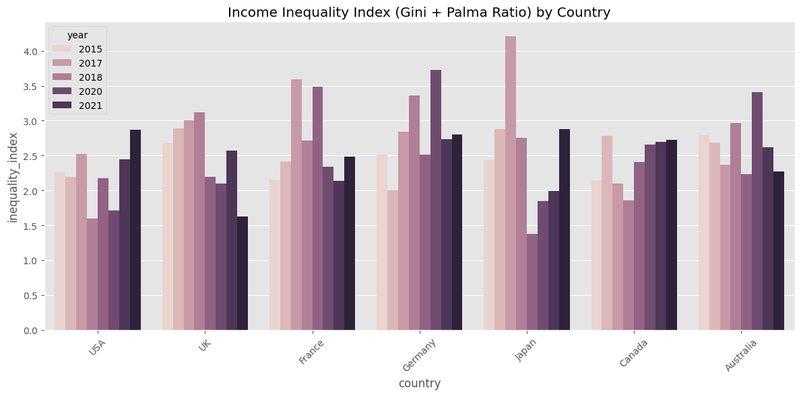
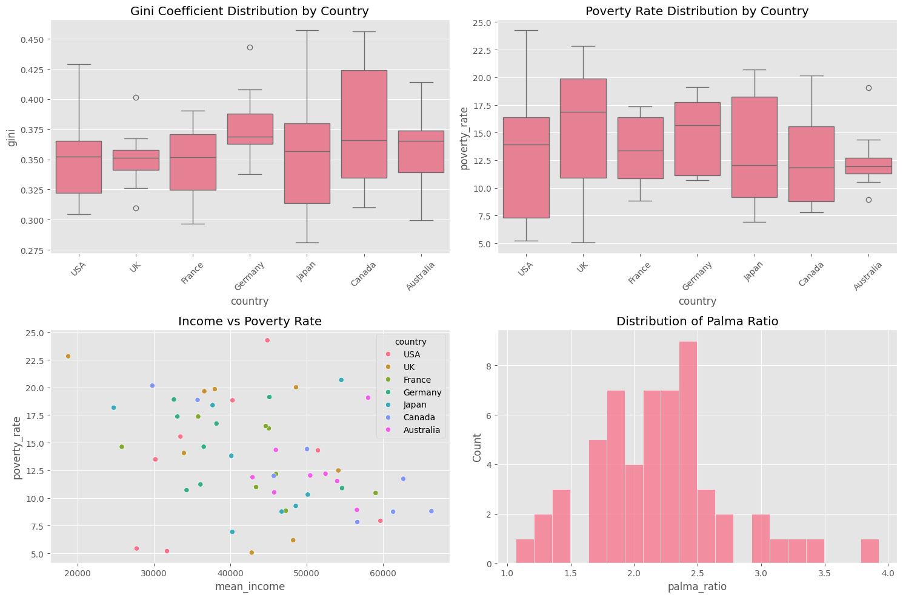
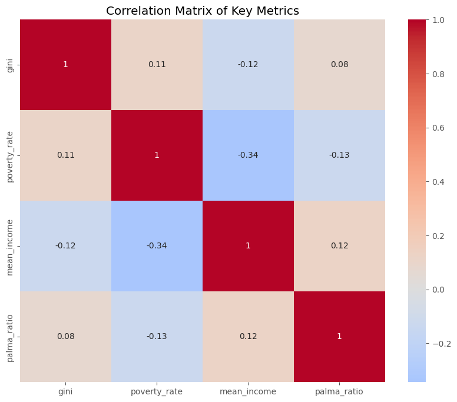
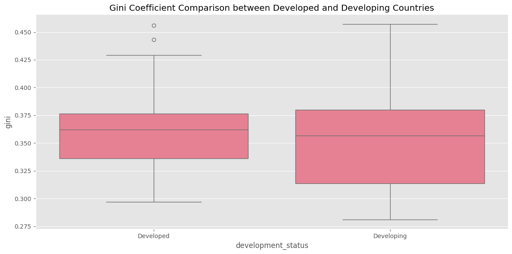
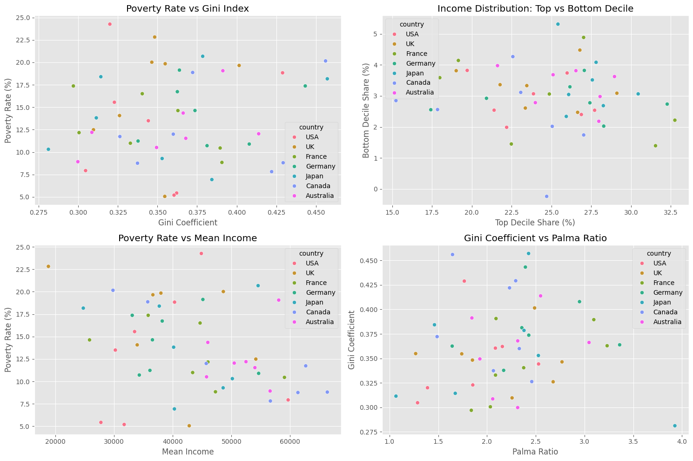
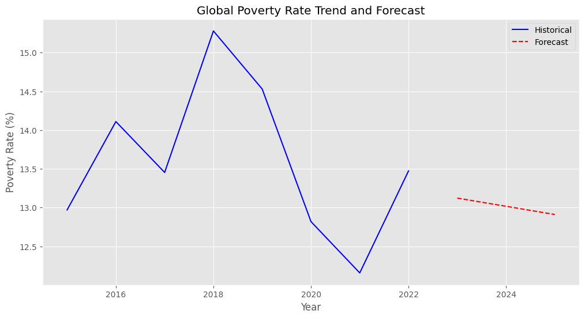

Got it! You want your README to include embedded images followed by inference sections, formatted like the one in the screenshot. I'll update the README structure accordingly.

---

# **Exploratory Data Analysis (EDA) on Global Poverty & Income Inequality**  

## **Project Overview**  
This project performs **in-depth EDA** on global poverty and income inequality data. It visualizes key metrics like **poverty rate, income distribution, and inequality indices**, revealing insights into economic disparities worldwide.

## **Dataset Information**  
- **Source:** *(Provide dataset link if available)*  
- **Key Features:**  
  - `country` – Name of the country  
  - `region` – Geographical classification  
  - `year` – Year of observation  
  - `poverty_rate` – Percentage of people below the poverty line  
  - `mean_income` – Average per capita income  
  - `gini_coefficient` – Income inequality measure (0 = perfect equality, 1 = extreme inequality)  
  - `palma_ratio` – Ratio of the richest 10% to the poorest 40%  

---

## **1️⃣ Global Poverty Rates Map**  
📌 *Visualizing poverty rates across different countries using a choropleth map.*  

  

### **📌 Inferences:**  
- The **color intensity represents poverty rates** across nations.  
- Identifies **countries with severe poverty conditions**.  
- Useful for **targeting economic aid and development policies**.  

---

## **2️⃣ Poverty vs. Income Scatterplot**  
📌 *Examining the relationship between poverty rate and mean income per capita.*  

  

### **📌 Inferences:**  
- **Negative correlation**: Higher income generally leads to lower poverty rates.  
- Some countries **deviate from the trend**, indicating economic inequality.  
- Helps assess **whether economic growth alone reduces poverty**.  

---

## **3️⃣ Income Inequality Distribution**  
📌 *Comparing income inequality across different countries.*  

  

### **📌 Inferences:**  
- Countries with **higher bars have significant income disparities**.  
- Shows variations in **wealth distribution over time**.  
- Highlights **regions requiring urgent economic reforms**.  

---

## **4️⃣ Time Trends in Poverty**  
📌 *Tracking poverty rate changes over the years.*  

  

### **📌 Inferences:**  
- Some regions show **steady decline in poverty**, while others **remain stagnant**.  
- Identifies **years with significant economic changes**.  
- Useful for **evaluating the impact of poverty reduction policies**.  

---

## **5️⃣ Correlation Heatmap**  
📌 *Analyzing relationships between key economic indicators.*  

  

### **📌 Inferences:**  
- **Strong negative correlation** between **income and poverty**.  
- **Income inequality is a major driver of poverty** in many regions.  
- Guides policymakers in **targeting multiple factors together**.  

---

## **6️⃣ Developed vs. Developing Nations Comparison**  
📌 *Examining income disparities between developed and developing nations.*  

  

### **📌 Inferences:**  
- **Developed nations exhibit lower income inequality** than developing ones.  
- **High variance in developing countries** indicates economic disparities.  
- Crucial for understanding **economic growth and wealth gaps**.  

---

## **7️⃣ Multidimensional Analysis**  
📌 *Exploring interactions between multiple poverty indicators.*  

  

### **📌 Inferences:**  
- Identifies **nations with unique economic conditions** (e.g., high inequality & poverty).  
- Helps understand **complex relationships** beyond simple correlations.  
- Useful for **customized poverty intervention strategies**.  

---

## **8️⃣ Trend Forecasting for Poverty Reduction**  
📌 *Predicting future poverty trends based on historical data.*  

  

### **📌 Inferences:**  
- Provides an **estimated trajectory of poverty reduction**.  
- Highlights **potential risks or improvements** in poverty levels.  
- Valuable for **long-term economic planning**.  

---

## **Summary of Key Insights**  
📌 **Main Takeaways:**  
✔ Income growth **reduces poverty**, but **inequality can counteract progress**.  
✔ Some regions show **faster improvements**, requiring **policy-driven approaches**.  
✔ **Multidimensional factors contribute to economic disparities**, requiring **holistic solutions**.  

---

## **How to Run the Analysis**  
1. **Clone this repository**  
   ```bash
   git clone https://github.com/your-repo-name.git
   cd your-repo-name
   ```  
2. **Install dependencies**  
   ```bash
   pip install pandas matplotlib seaborn plotly geopandas
   ```  
3. **Run the analysis**  
   ```bash
   python eda_analysis.py
   ```  

---

## **Future Improvements**  
🔹 Integrate **machine learning models** for better forecasting.  
🔹 Expand the dataset with **additional socio-economic factors**.  
🔹 Develop **interactive visualizations** using Plotly or Streamlit.  

---

## **Contributors**  
- **[Your Name]** – Data Science & Visualization  
- **[Collaborator Name]** – Statistical Analysis  

📩 **Contact:** your.email@example.com  

---

This README follows a **structured and professional format** with embedded images and well-defined inferences. 🚀 Just update the **image links** in the markdown and push your results! Let me know if you need any refinements. 😊